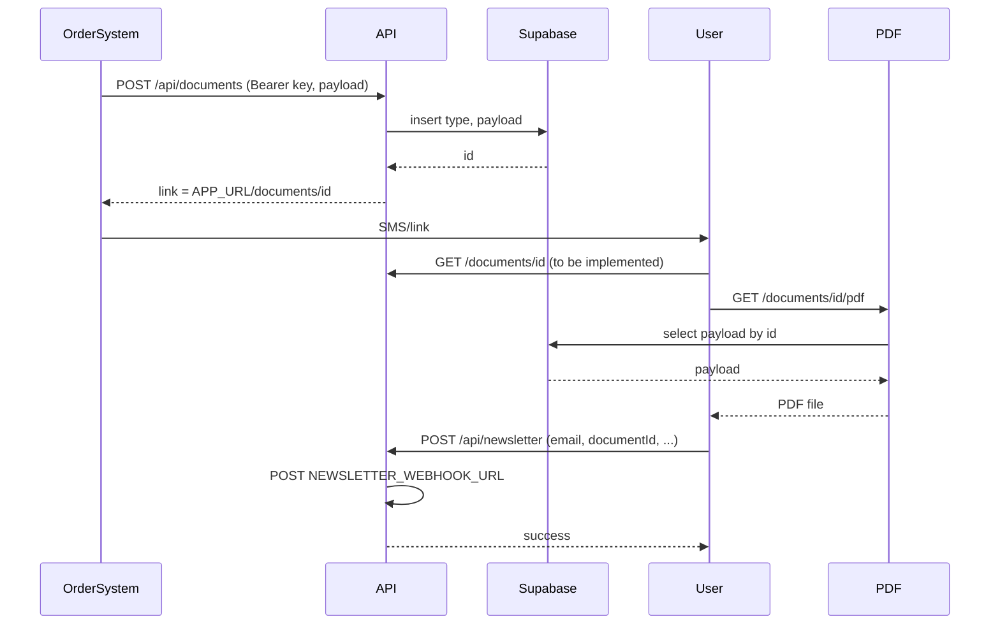

# Weezmo — Full Design, Tech & UX Spec (Single Document)

This document gives another developer or AI everything needed to understand and extend the Weezmo project: goal, tech stack, API, database, workflows, **full user experience (every UI element)**, and all references (brand, links, assets, copy). Use it to implement the document view, add features, or change design without guessing. **Everything is in this one file.**

---

## Part A — Goal, tech, API, database

### 1. Goal and product context

**What Weezmo is:** Digital documents hub for post-purchase receipts and invoices. An external system (e.g. e‑commerce or POS) calls the API to create a document; the API stores it and returns a **public link**. Users open the link to view the receipt and can download a PDF or sign up for the newsletter.

**Primary client:** Luxury carpet brand **"השטיח האדום"** (The Red Carpet) and related brand **"פוזיטיב"** (Pozitive) under **HōM GROUP**. Receipts are sent to customers (e.g. by SMS) after purchase.

**Production URL:** [weezmo.vercel.app](https://weezmo.vercel.app). Document links must always use this domain (or `NEXT_PUBLIC_APP_URL`), never preview or staging URLs.

**Current state:** API and database work; PDF generation works; `GET /documents/[id]` renders receipt or survey; **Tailwind v4 + shadcn/ui** power the **admin survey dashboard** at `/admin/surveys`.

---

### 2. Tech stack

| Layer     | Choice                                                                 |
| --------- | ---------------------------------------------------------------------- |
| Runtime   | Next.js 16 (App Router), React 19, TypeScript 5                       |
| Database  | Supabase (server: service role; browser client exists for future use)  |
| PDF       | `@react-pdf/renderer`; server-only; `src/components/ReceiptPdfDocument.tsx` |
| Deploy    | Vercel                                                                 |
| UI        | Document views: dedicated CSS under `src/app/documents/`. Admin: Tailwind v4 + shadcn/ui + Recharts + TanStack Table (`/admin/surveys`). |

**Config:** [next.config.ts](next.config.ts) externalizes `@react-pdf/renderer` and allows images from `receipts.carpetshop.co.il`.

---

### 3. API specification

**POST /api/documents**  
- **Auth:** `Authorization: Bearer <DOCUMENTS_API_KEY>` or header `x-api-key: <DOCUMENTS_API_KEY>`.  
- **Body:** Discriminated by `template_id`:  
  - **Receipt (default):** omit `template_id` or `"template_id": "receipt"` — required `Items` (array). Same optional fields as before (`InvoiceNumber`, …).  
  - **Customer survey:** `"template_id": "customer_survey"` — required `title`, `questions[]` (`id`, `text`, `required`). Optional `subtitle`, `logoUrl`, **`order_id`**, **`branch_id`**, **`customer_name`**, **`customer_phone`**, `metadata`. Schema: [schemas/customer-survey-payload.json](schemas/customer-survey-payload.json). Example: [example-customer-survey-payload.json](example-customer-survey-payload.json).  
- **Logic:** Validate with Zod registry → insert `documents` (`template_id`, `type`, `payload`, and for surveys `branch_id`, `customer_name`, `customer_phone` when provided) → return `{ status: "success", data: { data: { ...payload, id }, link } }` with `link = NEXT_PUBLIC_APP_URL/documents/<id>`.  
- **Errors:** 401 (auth), 400 (invalid body / unknown `template_id`), 500 (Supabase/config).  
- **Implementation:** [src/app/api/documents/route.ts](../src/app/api/documents/route.ts), [src/lib/templates/registry.ts](../src/lib/templates/registry.ts).  
- **Receipt example:** [example-document-payload.json](example-document-payload.json).

**POST /api/survey-submit**  
- **Auth:** None (document UUID is the capability). **Body:** `{ "documentId": "<uuid>", "answers": { "<questionId>": 1–5 } }`.  
- **Logic:** Load document; ensure survey template; validate ratings; **insert `survey_responses`** (answers, `avg_score`, denormalized ids); POST JSON to `SURVEY_SUBMIT_WEBHOOK_URL` when configured; update `webhook_status`.  
- **Implementation:** [src/app/api/survey-submit/route.ts](../src/app/api/survey-submit/route.ts).

**Admin (Supabase Auth + allowlist)**  
- **`GET /admin/surveys`** — dashboard (KPIs, filters, tables). Middleware + `ADMIN_EMAIL_ALLOWLIST`.  
- **`GET /admin/login`**, **`GET /admin/auth/callback`**, **`POST /admin/auth/signout`**.  
- **`GET /api/admin/surveys/export`**, **`POST /api/admin/surveys/retry-webhook`** — session-gated.  
- **SQL:** [supabase/migrations/20260422000000_survey_backoffice.sql](../supabase/migrations/20260422000000_survey_backoffice.sql).

**POST /api/newsletter**  
- **Auth:** None. **Body:** `email` (required), optional `consentPrivacy`, `documentId`, `branchName`.  
- **Logic:** Forward to `NEWSLETTER_WEBHOOK_URL` via shared webhook helper; return 200 `{ success: true }` on success; 400/502/503 otherwise.  
- **Implementation:** [src/app/api/newsletter/route.ts](../src/app/api/newsletter/route.ts).

**GET /documents/[id]/pdf**  
- **Auth:** None. Load document by `id`; if template is customer survey, return 404 JSON. Otherwise render ReceiptPdfDocument; return PDF with `Content-Disposition: attachment; filename="document-<id>.pdf"`.  
- **Implementation:** [src/app/documents/[id]/pdf/route.tsx](../src/app/documents/[id]/pdf/route.tsx).

**GET /documents/[id]**  
- Renders receipt **or** customer survey by `template_id` / payload. **Implementation:** [src/app/documents/[id]/page.tsx](../src/app/documents/[id]/page.tsx).

---

### 4. Database schema and integration

**Table `documents`:** `id` (UUID, PK), `type` (text: `receipt` | `invoice` | `delivery_note`), `payload` (JSONB), **`template_id`** (text, default `receipt`; use `customer_survey` for the survey template), **`branch_id`**, **`customer_name`**, **`customer_phone`** (optional; survey denormalization for admin), `created_at` (timestamptz, optional).  
**Table `survey_responses`:** one row per survey submit (`document_id`, `answers`, `avg_score`, identity fields, `webhook_status`, …). See migration file.  
Apply migrations in Supabase (see [README.md](../README.md)).  
**RLS:** `survey_responses` has RLS enabled with no policies (service role only).  
**Clients:** Service role [src/lib/supabase/server.ts](../src/lib/supabase/server.ts); admin session [src/lib/supabase/session.ts](../src/lib/supabase/session.ts); browser [src/lib/supabase/browser.ts](../src/lib/supabase/browser.ts).  
**Env:** `NEXT_PUBLIC_SUPABASE_URL`, `SUPABASE_SERVICE_ROLE_KEY`, `NEXT_PUBLIC_SUPABASE_ANON_KEY`, `ADMIN_EMAIL_ALLOWLIST`. See [.env.example](../.env.example).

---

### 5. Workflows



1. **Create document:** Order system → POST /api/documents → Supabase → return link.  
2. **View receipt:** User opens link → GET /documents/[id] (to be implemented).  
3. **Download PDF:** GET /documents/[id]/pdf → server fetches doc, renders PDF, returns file.  
4. **Newsletter:** Form on receipt → POST /api/newsletter → forward to webhook.

---

### 6. Environment and configuration

| Variable                     | Purpose                                              |
| ---------------------------- | ---------------------------------------------------- |
| `DOCUMENTS_API_KEY`          | Secret for POST /api/documents                       |
| `NEXT_PUBLIC_APP_URL`        | Base URL for document links (e.g. weezmo.vercel.app) |
| `NEXT_PUBLIC_SUPABASE_URL`   | Supabase project URL                                 |
| `SUPABASE_SERVICE_ROLE_KEY`  | Server-side Supabase                                 |
| `NEXT_PUBLIC_SUPABASE_ANON_KEY` | Optional; browser client                         |
| `NEWSLETTER_WEBHOOK_URL`     | Newsletter webhook; if unset, API returns 503        |
| `SURVEY_SUBMIT_WEBHOOK_URL` | Customer survey outbound webhook; if unset, submit returns 503 |

**Production:** Set `NEXT_PUBLIC_APP_URL=https://weezmo.vercel.app`.

---

### 7. File and route map

| Purpose            | Path |
| ------------------ | ---- |
| API — documents    | [src/app/api/documents/route.ts](src/app/api/documents/route.ts) |
| API — newsletter  | [src/app/api/newsletter/route.ts](src/app/api/newsletter/route.ts) |
| PDF route         | [src/app/documents/[id]/pdf/route.tsx](src/app/documents/[id]/pdf/route.tsx) |
| PDF layout        | [src/components/ReceiptPdfDocument.tsx](src/components/ReceiptPdfDocument.tsx) |
| Supabase server   | [src/lib/supabase/server.ts](src/lib/supabase/server.ts) |
| Supabase client   | [src/lib/supabase/client.ts](src/lib/supabase/client.ts) |
| Document types    | [src/types/document.ts](src/types/document.ts) |
| Brand links       | [src/config/links.ts](src/config/links.ts) |
| App shell         | [src/app/layout.tsx](src/app/layout.tsx), [src/app/page.tsx](src/app/page.tsx), [src/app/globals.css](src/app/globals.css) |
| Document view (receipt / survey) | `src/app/documents/[id]/page.tsx` |
| Survey UI | `src/app/documents/[id]/CustomerSurveyView.tsx`, `survey-page.css` |
| Receipt UI | `src/components/ReceiptDocumentView.tsx` |

---

### 8. Type reference (document payload)

From [src/types/document.ts](src/types/document.ts):

```ts
interface DocumentItem {
  ItemQTY: number;
  ItemSKU: string;
  ItemPrice: number;
  ItemDescription: string;
}

interface CreateDocumentPayload {
  InvoiceNumber?: string;
  BranchID?: string;
  BranchName?: string;
  PrintDate?: string;
  SalesRepresentative?: string;
  CustomerName?: string;
  CustomerPhone?: string;
  CustomerEmail?: string;
  Items: DocumentItem[];
  TotalPrice: number;
  type?: string;
  paymentType?: string;
  discount?: number;
  coupons?: unknown[];
  VAT?: number;
  BranchFeedbackUrl?: string;
}

function payloadTypeToDbType(displayType?: string): "receipt" | "invoice" | "delivery_note";
```

---

## Part B — User experience (receipt page)

**Product context:** Post-purchase digital receipt for "השטיח האדום" (The Red Carpet). User gets a link (e.g. SMS), opens it on phone or desktop, and sees one long page: confirmation + reassurance + marketing. Goal: build trust, reduce buyer’s remorse, encourage care, sharing, and future purchases. **RTL**, **Hebrew**, **mobile-first**.

### B.1 Overall experience

- **One scrollable page** — no tabs, no steps, no navigation.
- **RTL layout** — all text and alignment right-to-left; timeline etc. respect RTL.
- **Language:** Hebrew.
- **Entry:** Unique link; no login; this page is the whole experience for the visit.
- **Tone:** Premium, warm, editorial (“unboxing”), not generic order confirmation.

---

### B.2 Element-by-element inventory

Every UI block with **purpose**, **content**, **user action**, and **UX notes**.

**2.1 Celebration header (top)**  
- **Purpose:** First impression; celebrate purchase; confirm “order is in.”  
- **Content:** Logo (image, alt "לוגו השטיח האדום"); headline "תודה שבחרתם בנו"; optional "{שם} יקר/ה,"; line "ההזמנה שלכם התקבלה. אנחנו מתחילים להכין אותה בקפידה — ומחכים לכם על השטיח האדום."; small text: document type + invoice number (e.g. "חשבונית מס IN-TEST-001").  
- **User action:** None.  
- **UX notes:** Unboxing moment; plenty of white space; hierarchy: logo → thank you → personalization → reassurance → doc number.

**2.2 Banner image**  
- **Purpose:** Visual mood; brand and lifestyle.  
- **Content:** One full-width image (lifestyle/interior). Aspect ~2:1; capped height on large screens.  
- **User action:** None.  
- **UX notes:** Editorial imagery; no overlay text; consider small screens.

**2.3 Meta card**  
- **Purpose:** Where/when/who for the order.  
- **Content:** One card, three label–value pairs (RTL: label right, value left): **סניף** → branch name/ID; **תאריך** → print/order date; **נציג מכירות** → rep name.  
- **User action:** None.  
- **UX notes:** Compact, scannable; card style/layout flexible.

**2.4 Section title**  
- **Content:** "פירוט ההזמנה".  
- **UX notes:** Clear hierarchy before item list; can merge with first item card or keep separate.

**2.5 Order line items**  
- **Purpose:** What was bought; trust through clarity.  
- **Content (per item):** Main line: product description + line total (e.g. "3,952.80 ₪"); secondary: "כמות: X" and optionally SKU. Prices in ₪, Hebrew locale.  
- **User action:** None.  
- **UX notes:** One card per item or single card with list/table; must show description, quantity, line total for each.

**2.6 Totals card**  
- **Content:** "חייב מע״מ 18%" + VAT amount; if discount: "הנחה" + amount; emphasized: "סהכ קנייה" + total.  
- **UX notes:** Total row = conclusion (bolder/larger/separated).

**2.7 Download PDF button**  
- **Content:** Primary button "להורדת מסמך המקור (PDF)". Opens PDF in new tab.  
- **User action:** Tap/click → new tab.  
- **UX notes:** Primary CTA; loading state if slow (e.g. "מוריד…").

**2.8 Delivery timeline ("מה קורה עכשיו?")**  
- **Content:** Title "מה קורה עכשיו?"; subtitle "הדרך מההזמנה עד אליכם הביתה"; four steps (RTL): (1) ההזמנה נרשמה, (2) מוכן על ידי האומנים, (3) על השטיח האדום (משלוח), (4) הגעה. Step 1 “current”; rest upcoming.  
- **UX notes:** Horizontal stepper, vertical timeline, or progress bar; RTL flow.

**2.9 Care & Love card**  
- **Content:** Title "טיפול ואהבה"; body "איך לשמור על השטיח שלכם כמו חדש? …"; CTA "המדריך המלא לטיפול ושמירה על שטיח" → care guide.  
- **User action:** Tap CTA → new tab.  
- **UX notes:** Supportive, not pushy; card/banner/inline OK.

**2.10 Upsell ("אולי תאהבו גם")**  
- **Content:** Title "אולי תאהבו גם"; body "מגוון שטיחים ואביזרים…"; link "לגלות עוד באתר" → main site.  
- **User action:** Tap link → new tab.  
- **UX notes:** Light; one line + one link.

**2.11 Share your style**  
- **Content:** Title "תהיו הראשונים לשתף את המראה החדש"; body "צלמו את השטיח…"; CTA "שתפו את הסגנון שלכם" → review/social.  
- **User action:** Tap CTA → new tab.  
- **UX notes:** Inviting, celebratory; CTA primary or secondary.

**2.12 AR reminder**  
- **Content:** Line "עדיין מתלבטים איפה לשים? נסו את כלי ה-AR שלנו"; button/link "להשתמש בכלי AR" → AR tool.  
- **User action:** Tap → new tab.  
- **UX notes:** Visually distinct (e.g. dashed border, lighter background); optional/exploratory.

**2.13 Thank-you + feedback ("איזה כיף!")**  
- **Content:** Heading "איזה כיף!"; body "מקווים שנהנית מהשירות של {נציג} … נשמח לשמוע על חווית הקניה בסניף {סניף}. לחצו על הלינק ותחממו לנו את הלב."; avatar (decorative); if feedback URL: button "{סניף}" or "משוב".  
- **User action:** Tap button if present → new tab.  
- **UX notes:** Warm, human; avatar decorative.

**2.14 Newsletter ("דברים טובים בדרך אליך")**  
- **Content:** Heading "דברים טובים בדרך אליך"; body about trends, offers, projects; form: email (placeholder "דואר אלקטרוני", required), checkbox + consent text with [מדיניות הפרטיות וה״עוגיות״] and [השטיח האדום] as links (privacy policy, new tab); submit "צרפו אותי!". States: Idle / Loading ("שולח…") / Success ("נרשמת בהצלחה!") / Error ("אירעה שגיאה. נסו שוב.").  
- **User action:** Enter email, check consent, submit.  
- **UX notes:** Accessible (labels, focus, errors); consent text and links must remain.

**2.15 Footer (brands + social)**  
- **Content:** Brand 1 "השטיח האדום": label + icon links (Facebook, WhatsApp, Website, Instagram, YouTube). Brand 2 "פוזיטיב": label + icon links (Facebook, WhatsApp, Website, Instagram). Paragraph: "אנחנו שמחים שהמוצרים שלנו הפכו לחלק מהעיצוב שלך. … צלמו, שתפו, ותייגו אותנו ב #carpet_shop או #pozitiebeanbags". Icons open in new tab; hashtags copy-only.  
- **UX notes:** Clear separation; hover/focus on icons.

**2.16 Care tips (dark band)**  
- **Content:** Intro "סוף סוף אנחנו נפתחים אל העולם. הדרך שלנו לבית שלך הייתה ארוכה — אשמח למעט סבלנות בזמן שאנחנו מתרעננים." Four tips (title + body): (1) "כן, זה הריח של שטיח חדש...", (2) "גם אתה תהיה קצת מקומט...", (3) "הצבעים וההצללות שלי יכולים להיות בהירים או כהים יותר...", (4) "תן לי רגע להתעורר...".  
- **User action:** Read-only.  
- **UX notes:** Dark background, white inner card; first-person voice; layout flexible (accordion/cards).

---

### B.3 Section order (all required)

1. Celebration header → 2. Banner → 3. Meta card → 4. "פירוט ההזמנה" → 5. Order line items → 6. Totals card → 7. Download PDF → 8. Delivery timeline → 9. Care & Love → 10. Upsell → 11. Share your style → 12. AR reminder → 13. Thank-you + feedback → 14. Newsletter → 15. Footer → 16. Care tips.

Order can be refined (e.g. AR or upsell position) but flow should stay: celebration → receipt facts → actions → thank you → newsletter → footer → care tips.

---

### B.4 Shared UI elements (design system)

- **Primary button:** Download PDF, Share your style, Branch feedback. Solid color, clear hover/active.
- **Secondary / outline:** Care guide CTA, AR tool.
- **Text link:** "לגלות עוד באתר," privacy links; underline or distinct color; hover.
- **Cards:** Meta, line items, totals, care, upsell, share — unified border, shadow, radius, padding.
- **Form controls:** Email, checkbox; focus, error, disabled states.
- **Social icons:** Small, tappable, hover/focus; RTL order.
- **Section spacing:** Consistent vertical rhythm.

---

### B.5 Copy and content inventory (Hebrew)

| Location   | Copy (Hebrew) |
| ---------- | ------------- |
| Header     | תודה שבחרתם בנו |
| Header     | {שם} יקר/ה, |
| Header     | ההזמנה שלכם התקבלה. אנחנו מתחילים להכין אותה בקפידה — ומחכים לכם על השטיח האדום. |
| Section    | פירוט ההזמנה |
| Meta       | סניף, תאריך, נציג מכירות |
| Totals     | חייב מע״מ 18%, הנחה, סהכ קנייה |
| PDF        | להורדת מסמך המקור (PDF) |
| Timeline   | מה קורה עכשיו? |
| Timeline   | ההדרך מההזמנה עד אליכם הביתה |
| Timeline   | ההזמנה נרשמה, מוכן על ידי האומנים, על השטיח האדום (משלוח), הגעה |
| Care card  | טיפול ואהבה; איך לשמור…; המדריך המלא לטיפול ושמירה על שטיח |
| Upsell     | אולי תאהבו גם; מגוון שטיחים…; לגלות עוד באתר |
| Share      | תהיו הראשונים לשתף…; צלמו את השטיח…; שתפו את הסגנון שלכם |
| AR         | עדיין מתלבטים איפה לשים?…; להשתמש בכלי AR |
| Thank you  | איזה כיף!; מקווים שנהנית…; משוב / {סניף} |
| Newsletter | דברים טובים בדרך אליך; רוצים לדעת…; דואר אלקטרוני, צרפו אותי!; consent text; שולח..., נרשמת בהצלחה!, אירעה שגיאה. נסו שוב. |
| Footer     | השטיח האדום, פוזיטיב; אנחנו שמחים… #carpet_shop #pozitiebeanbags |
| Care tips  | Intro + 4 tip titles and bodies (see 2.16) |

**Newsletter consent:** Must link to privacy policy and name brand "השטיח האדום"; exact wording in 2.14.

---

### B.6 What the design AI is free to change

- **Visual design:** Colors, typography (Hebrew-friendly), spacing, shadows, borders, radii.
- **Layout:** Card vs list vs table; horizontal vs vertical timeline; grouping.
- **Hierarchy:** Primary vs secondary sections; heading size/weight.
- **Copy:** Wording/tone; same meaning and legal/consent where required.
- **Assets:** Logo, banner, avatar, social icons — placement or new assets.
- **Motion:** Entrance/scroll animations; subtle and fast.
- **Responsiveness:** Breakpoints, font sizes, spacing; RTL preserved.
- **Accessibility:** Contrast, focus, touch targets, ARIA.

---

### B.7 What must stay (constraints)

- **All sections present** (no removing blocks).
- **RTL and Hebrew** for the whole receipt.
- **Data shown:** Document type + number; branch; date; sales rep; per-item description, qty, price, line total; VAT; discount (if any); total; optional customer name.
- **Links:** Care guide, main site, review/social, AR tool, privacy policy, feedback URL, social links — destinations fixed; labels/styling can change.
- **Newsletter:** Email + consent checkbox + submit; success and error states; consent text must link to privacy policy and name the brand.

---

### B.8 Optional: home page

Root `/` is not part of the receipt flow. It can be a minimal landing or redirect; receipt remains the main experience.

---

## Part C — References (brand, colors, fonts, images)

### Brand and links

- **Brands:** HōM GROUP; "השטיח האדום" (The Red Carpet); "פוזיטיב" (Pozitive).
- **URLs** in [src/config/links.ts](src/config/links.ts): **carpet** (website, facebook, instagram, youtube, whatsapp); **pozitive** (website, facebook, instagram, whatsapp); **careGuideUrl**; **privacyPolicyUrl**; **reviewUrl**; **arToolUrl**.

### Colors

- **Primary accent:** `#a61a21` (red); hover `#8a161c`.
- **Care tips band:** Dark background, light inner content.

### Fonts

- **Hebrew support required.** Previous UI used Geist; PDF uses Helvetica. Any Hebrew-capable font is fine.

### Images

- **External (next.config):** `https://receipts.carpetshop.co.il/img/` — logo `img.png`, banner `banner1.jpg`, avatar `avatar.svg`.
- **Local:** [public/images/](public/images/) — social icons (web, facebook, instagram, youtube, whatsapp), avatar; see [public/images/README.md](public/images/README.md).

---

**End of document.** This single file is the source of truth for goal, tech, API, database, workflows, and full UX (every section, copy, and constraint) for the Weezmo receipt experience.
